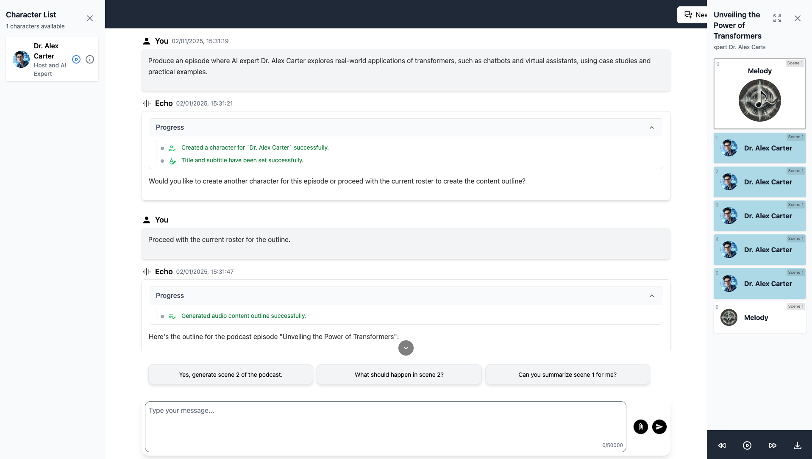
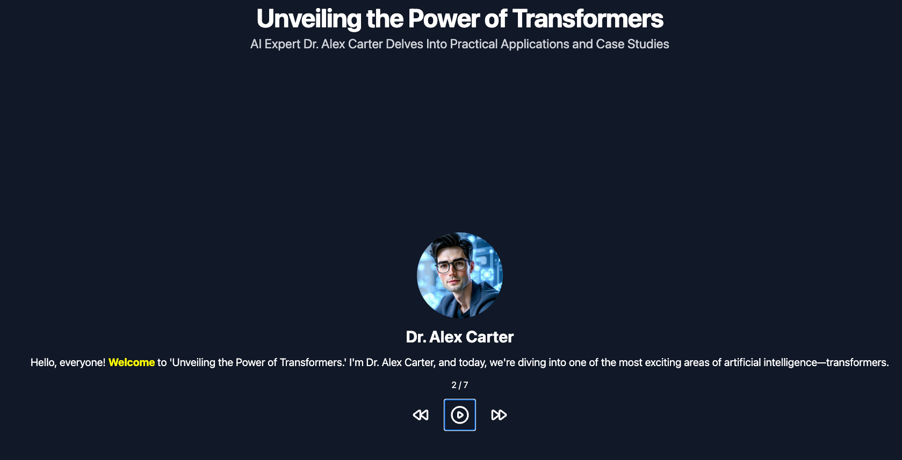
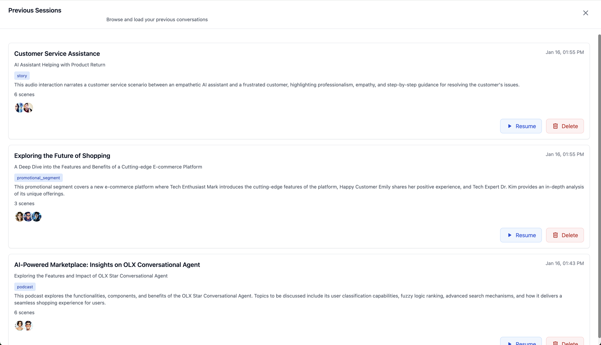

# Project Echo

[](https://fastapi.tiangolo.com/)
[](https://vuejs.org/)
[](https://www.mongodb.com/)
[](https://aws.amazon.com/s3/)
[](https://tailwindcss.com/)

> An AI-powered voice director assistant for creating engaging audio content with distinct character voices.

## 📑 Table of Contents

- [Overview](#-overview)
- [Features](#-features)
- [Screenshots](#-screenshots)
- [Technologies Used](#️-technologies-used)
- [Getting Started](#-getting-started)
  - [Prerequisites](#prerequisites)
  - [Environment Variables](#environment-variables)
  - [Docker Setup](#docker-setup)
  - [Local Setup](#local-setup)
- [Contributing](#-contributing)
- [License](#-license)
- [Disclaimer](#️-disclaimer)
- [Limitation of Liability](#️-limitation-of-liability)
- [Acknowledgements](#-acknowledgements)

## 🎯 Overview

Project Echo revolutionizes the creation of audiobooks, podcasts, and plays by providing tools to generate unique characters and produce high-quality audio segments. The project aims to assist users in creating compelling audio content through AI-powered voice generation and character development.

## ✨ Features

- **Character Creation**: Generate diverse characters with unique:
  - Voices and personalities
  - Names and titles
  - Backgrounds and opinions

- **Audio Generation**: Produce high-quality audio segments using advanced text-to-speech technology

- **Interactive Conversations**: Engage in dynamic conversations with the AI assistant

- **File Processing**: Handle various formats including PDFs, Word documents, and images

## 🤖 How It Works

The AI agent follows a structured process to generate high-quality audio content:

1. **Topic Understanding & Character Creation**
   - Analyzes your provided topic or content
   - Creates unique characters with distinct personalities and voices tailored to your content
   - Develops detailed character backgrounds and relationships

2. **Audio Content Outline**
   - Generates a comprehensive outline of different scenes
   - Structures the content for optimal flow and engagement
   - Plans character interactions and dialogue sequences

3. **Scene-by-Scene Generation**
   - Processes each scene individually
   - Creates multiple audio segments per scene
   - Ensures proper character voice consistency throughout
   - Allows playback and review in the integrated audio player

4. **Content Export**
   - Access completed audio segments in the right drawer
   - Download functionality for all generated content
   - Easy export for use in your projects

## 📸 Screenshots

### Main application interface


### Character profile creation


### Audio player with subtitles


### Session history and management


## 🛠️ Technologies Used

### Backend
- FastAPI: Modern web framework for building APIs
- MongoDB: NoSQL database for data storage
- LiteLLM: Language model integration
- AWS S3: Audio file storage and serving

### Frontend
- Vue.js: Progressive JavaScript framework
- Tailwind CSS: Utility-first CSS framework

## 🚀 Getting Started

### Prerequisites

- Docker and Docker Compose (for Docker setup)
- Python 3.8+ (for local setup)
- Node.js and npm (for local setup)

### Environment Variables

The application requires specific environment variables to function properly. At minimum, you need:

- `OPENAI_API_KEY` (Required): Essential for text generation

Optional but recommended:
- `ELEVENLABS_API_KEY`: For improved audio quality (subscription required)
- `KOKORO_BASE_URL`: For local audio generation
- `STABILITY_API_KEY`: For image generation
- `OPENAI_IMAGE_MODEL`: Defaults to "dall-e-2"

Refer to `.env.example` for a complete list of variables.

### Docker Setup

1. Ensure the following ports are available:
   - 8080: Frontend
   - 8000: Backend
   - 27017: MongoDB
   - 9000: MinIO

2. Build and run the services:
```bash
docker compose build
docker compose up
```

3. Access the application at `http://localhost:8080`

**Tips:**
- Mount a volume to `/app` for faster builds
- Use `docker compose up --attach backend` to view specific service logs

### Local Setup

#### Backend
```bash
cd backend
python -m venv venv

# Windows
venv\Scripts\activate
# macOS/Linux
source venv/bin/activate

pip install -r requirements.txt
uvicorn app.main:app --reload
```

#### Frontend
```bash
cd frontend
npm install
npm run serve
```

Access the application at `http://localhost:8080`

## 👥 Contributing

We welcome contributions to Project Echo! Here's how you can help:

1. Fork the repository
2. Create a feature branch (`git checkout -b feature/amazing-feature`)
3. Commit your changes (`git commit -m 'Add amazing feature'`)
4. Push to the branch (`git push origin feature/amazing-feature`)
5. Open a Pull Request

Please ensure your PR description clearly describes the problem and solution.

## 📄 License

This project is licensed under the Apache License, Version 2.0. See the [LICENSE](LICENSE) file for details.

## ⚠️ Disclaimer
Project Echo is provided "as is," without warranty of any kind, express or implied, including but not limited to the warranties of merchantability, fitness for a particular purpose, and noninfringement. In no event shall the authors or copyright holders be liable for any claim, damages, or other liability, whether in an action of contract, tort, or otherwise, arising from, out of, or in connection with the software or the use or other dealings in the software.

## ⚖️ Limitation of Liability
The authors and contributors shall not be responsible for any direct, indirect, incidental, special, exemplary, or consequential damages (including but not limited to procurement of substitute goods or services, loss of use, data, or profits, or business interruption) however caused and on any theory of liability, whether in contract, strict liability, or tort (including negligence or otherwise) arising in any way out of the use of this software, even if advised of the possibility of such damage.

## 🙏 Acknowledgements
List of third-party components and libraries used in the software and their licenses is available at [third-party notices](third-party-notices.md).

